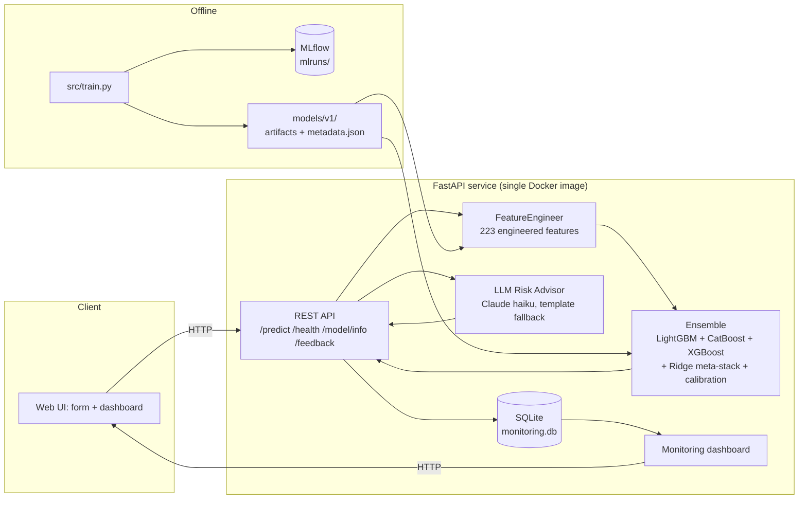

# FloodGuard AI

End-to-end MLOps system for **flood risk prediction in Sri Lanka** — built for the
*ML Opsidian: Genesis* hackathon Final Round. It evolves the Initial Round model
into a deployed product: a FastAPI service that scores a location's flood risk
(0-1), explains the prediction, generates an AI-written risk report, and exposes
a monitoring dashboard for everything it serves.

**Live demo:** `<RENDER_URL_HERE>`

---

## 1. What it does

Given a location's environmental, infrastructure, and socioeconomic attributes,
FloodGuard AI returns:

- A **flood risk score** (0-1) and category (`Low` / `Moderate` / `High` / `Severe`)
- The **top contributing factors** for that prediction
- An **AI-generated risk report** (Claude, with a deterministic fallback) summarizing
  the situation and recommending concrete actions
- **Out-of-distribution flags** when inputs fall outside the training data's
  typical ranges

Every prediction and piece of user feedback is logged and visualized on a
built-in **monitoring dashboard**.

---

## 2. Architecture



**Request flow:** the browser posts a form to `/predict` → `FeatureEngineer`
turns the raw record into the same 223-feature matrix used in training →
the LightGBM/CatBoost/XGBoost ensemble produces base predictions → a Ridge
meta-model stacks them and applies a calibration shift → the result, top
feature contributions, and an LLM-written report are returned and logged to
SQLite for the dashboard.

---

## 3. Repository structure

```
flood-guard-ai/
├── data/                  train.csv / test.csv (Initial Round dataset)
├── src/
│   ├── config.py          paths, column groups, constants, custom metric
│   ├── data_validation.py schema/range checks + OOD flagging
│   ├── features.py        FeatureEngineer (fit/transform/save/load)
│   ├── train.py            training pipeline + MLflow logging
│   ├── inference.py        FloodRiskPredictor (single-record scoring)
│   └── llm_advisor.py      Claude risk report + template fallback
├── models/v1/              trained model artifacts + metadata.json
├── mlruns/                  MLflow local tracking store (experiment history)
├── app/
│   ├── main.py              FastAPI app (API + serves frontend/dist)
│   ├── schemas.py           pydantic request/response models
│   └── monitoring.py        SQLite logging + stats aggregation
├── frontend/                React + Vite + TypeScript + Tailwind UI
│   ├── src/pages/           Home, Predict, Dashboard, Impact
│   ├── src/components/       form fields, charts, risk gauge, live preview, etc.
│   └── dist/                 production build (generated, served by app/main.py)
├── tests/                   pytest suite (features, inference, API)
├── conftest.py              shared fixtures
├── Dockerfile / .dockerignore / render.yaml
├── .github/workflows/ci.yml CI: tests + docker build
├── requirements.txt         full dev environment
├── requirements-app.txt     minimal runtime deps (used by Docker image)
└── docs/                     technical report + presentation outline
```

---

## 4. The model

### Initial Round → Final Round

The Initial Round solution (`solution_v10.py`, in the companion repo) was a
5-model ensemble (LightGBM, LightGBM-DART, CatBoost, XGBoost, ExtraTrees) with
a Ridge meta-stack, 10-fold × 3-seed CV, pseudo-labeling, and mean calibration —
scoring **~0.383** on the custom metric. It was powerful but stateful and slow
(pseudo-labeling needs the full test set; multi-seed CV takes too long to retrain
on demand), so it can't be served live as-is.

FloodGuard AI **keeps the winning ideas** — the same feature-engineering
philosophy, ensemble + Ridge meta-stacking, and mean-target calibration — but
restructures them into a **`FeatureEngineer` fit/transform object** that can score
a *single new record* in milliseconds, and reduces the ensemble to **3 models /
5-fold CV / fixed hyperparameters** so it trains in under a minute and serializes
to ~14 MB of artifacts.

### Feature pipeline (`src/features.py`)

223 engineered features per record, including:

- Date/seasonal features, geo features (lat/lon, haversine distances)
- District-level statistics, quantiles, and ranks (precomputed lookup tables)
- KMeans cluster assignments (k = 5, 10, 20)
- Haversine-KNN target statistics via a `BallTree` over training coordinates
- Target encoding (out-of-fold for training, full-train means for inference)
- Empirical monotonic mappings for `*_qmap` columns
- Interaction features (e.g. `extreme_x_terrain`)

### Current model (v1)

| | |
|---|---|
| Features | 223 |
| Training rows | 20,886 |
| CV | 5-fold |
| Models | LightGBM, CatBoost, XGBoost |
| Meta-learner | Ridge (non-negative weights) on OOF predictions |
| Ridge weights | lgb 0.229 / cat 0.713 / xgb 0.134 |
| OOF custom metric (calibrated) | **0.4071** |
| Calibration shift | ≈ 0 (predicted mean already matches train mean) |
| Training time | ~45s |

Top contributing features (by LightGBM gain): `district_te`, `inund_log1p`,
`distance_to_river_m`, `reason_has_flood`, `extreme_x_terrain`.

---

## 5. MLOps components

### Data pipeline & validation (`src/data_validation.py`)
- `validate_training_data()` checks schema, nulls, and value ranges before training.
- `flag_out_of_distribution()` flags individual inference requests whose inputs
  fall outside the training data's typical ranges (surfaced in the API response
  and logged for monitoring).

### Model management (MLflow, `mlruns/`)
- `src/train.py` logs hyperparameters, per-fold and OOF metrics, the calibration
  shift, and the `metadata.json` artifact to a local MLflow file store on every
  run — giving experiment tracking, run comparison, and model versioning
  (`models/v1/`, `models/v2/`, … as the model evolves).
- Inspect with: `mlflow ui --backend-store-uri ./mlruns`

### Deployment (Docker + Render)
- One `Dockerfile` builds a single image containing the trained model artifacts,
  the FastAPI app, and the static frontend.
- `render.yaml` deploys it as a Render Docker web service with a `/health` check.
- See [§7 Deploying](#7-deploying).

### Monitoring (`app/monitoring.py` + `/dashboard`)
- Every `/predict` call is logged to SQLite (`monitoring.db`): inputs, score,
  category, model version, latency, OOD flag count.
- `/feedback` records user-submitted accuracy ratings.
- `/monitoring/stats` + the `/dashboard` page visualize: prediction volume,
  score distribution, risk-category breakdown, top districts, latency, and
  feedback.

### CI/CD (`.github/workflows/ci.yml`)
- On every push/PR to `main`: installs dependencies, runs the full `pytest`
  suite, then builds the Docker image — catching regressions before deploy.

---

## 6. AI Risk Advisor — disclosure

`src/llm_advisor.py` calls **Claude (`claude-haiku-4-5`)** via the Anthropic API
to turn a prediction + its top contributing features into a plain-language
summary and a list of recommended actions, returned as structured JSON.

- **Requires** the `ANTHROPIC_API_KEY` environment variable.
- **If the key is not set** (e.g. a fresh clone or a demo environment without
  credentials), the advisor falls back to a **deterministic template** keyed on
  risk category — the API and UI continue to work identically, with
  `ai_report.source` indicating `"llm"` or `"template"`.

No other external/third-party model, dataset, or service is used.

---

## 7. Running locally

```bash
git clone <REPO_URL>
cd flood-guard-ai
python3 -m venv .venv && source .venv/bin/activate
pip install -r requirements.txt

# (optional) enable the LLM advisor
export ANTHROPIC_API_KEY=sk-...

# train (reproduces models/v1/ — already included in the repo)
python -m src.train

# build the frontend (required once — app/main.py serves frontend/dist)
cd frontend && npm install && npm run build && cd ..

# run the app
uvicorn app.main:app --reload
```

Open `http://localhost:8000` for the landing page, `http://localhost:8000/predict`
for the flood risk predictor, `http://localhost:8000/dashboard` for the monitoring
dashboard, and `http://localhost:8000/docs` for interactive API docs.

For frontend development with hot reload, run `npm run dev` inside `frontend/`
(Vite dev server on `http://localhost:5173`). Set `VITE_API_BASE_URL=http://localhost:8000`
in `frontend/.env.local` to point the dev server at the FastAPI backend.

### Tests

```bash
pytest -v
```

---

## 8. Deploying (Render)

1. Push this repo to GitHub.
2. In Render: **New → Blueprint** → connect the repo (`render.yaml` is auto-detected),
   or **New → Web Service** with environment **Docker**.
3. (Optional) set `ANTHROPIC_API_KEY` in the service's environment variables to
   enable the LLM-generated risk reports.
4. Render builds the `Dockerfile` and exposes the service on `/health`,
   `/`, `/dashboard`, and the `/predict` etc. API endpoints.

Locally, the same image can be built and run with:

```bash
docker build -t floodguard-ai .
docker run -p 8000:8000 -e ANTHROPIC_API_KEY=sk-... floodguard-ai
```

---

## 9. API reference

| Method | Path | Description |
|---|---|---|
| `GET` | `/health` | Liveness + model-loaded check |
| `GET` | `/model/info` | Model version, metrics, feature importances, dropdown options, district defaults |
| `POST` | `/predict` | Score a record → risk score, category, top factors, AI report, OOD flags |
| `POST` | `/feedback` | Submit user feedback for a prediction |
| `GET` | `/monitoring/stats` | Aggregated monitoring stats for the dashboard |
| `GET` | `/` | Landing page (frontend) |
| `GET` | `/predict` | Flood risk predictor form (frontend) |
| `GET` | `/dashboard` | Monitoring dashboard (frontend) |

Full request/response schemas: `/docs` (Swagger UI) when the app is running.

---

## 10. Team

- _Add team member names / roles here._
