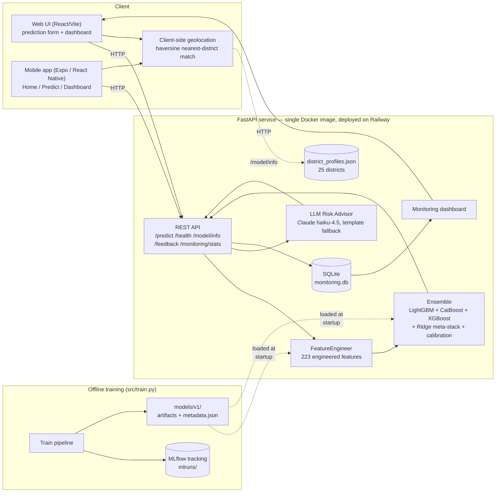

# Executive Summary

FloodGuard AI is an end-to-end MLOps system that turns the Initial Round flood-risk
model for Sri Lanka into a deployed product. It packages a 223-feature, 3-model
ensemble (the production evolution of the Initial Round's winning ideas) behind a
FastAPI service that serves a prediction form, a REST API, an AI-generated risk
report (Claude, with a deterministic fallback), and a live monitoring dashboard —
all from a single Docker image deployed on Railway. A companion **Expo /
React Native mobile app** (Android APK + Expo Go) talks to the same live backend
and adds a geolocation-based "what's the risk where I am right now" preview on
both clients.

This report covers Problem Understanding, System Architecture, the Machine
Learning Approach (Initial Round summary and Final Round improvements), and MLOps
Practices (deployment, monitoring, version control), per the Final Round
deliverable requirements.

---

# 1. Problem Understanding

## 1.1 Understanding of the Challenge

The underlying task, inherited from the Initial Round, is to predict a continuous
**`flood_risk_score`** in **[0, 1]** for locations across Sri Lanka's 25 districts,
given a synthetic dataset of 20,886 training records and 5,300 test records with
47 columns covering:

- **Geography**: latitude, longitude, district, elevation, distance to river
- **Climate**: 7-day and monthly rainfall, drainage index, seasonal index
- **Land**: land cover, soil type, NDVI/NDWI vegetation/water indices, built-up %
- **Infrastructure & socioeconomics**: population density, infrastructure score,
  road/water/electricity quality, distance to hospital/evacuation point
- **Event context**: current flood occurrence, inundated area, historical flood
  count, "is this place good to live" flag and reason

Models are scored with a **custom metric** that combines absolute and squared
error with an explained-variance penalty:

```
score = (0.5 * MAE + 0.5 * RMSE) * (1 + max(0, 1 - explained_variance))
```

Lower is better. The `(1 + max(0, 1 - EV))` term means a model that fits the
*absolute level* of the target well but fails to explain its *variance* (e.g. a
model that always predicts the mean) is penalized — both calibration and
discrimination matter.

The Final Round reframes this from "get the best leaderboard score" to: **take
that model and turn it into a usable, deployed, monitored system** while keeping
the Initial Round model as "a significant component" of the solution (Rule 1).

## 1.2 Key Observations

A few properties of the dataset shaped both the Initial Round model and how it
had to be re-engineered for production:

1. **The data is synthetic and noisy.** The target correlates only moderately
   with any single feature; no individual column dominates. This is why the
   Initial Round's strongest models were **ensembles of gradient-boosted trees
   with district-level aggregate features**, not simple linear models.

2. **`district` is the single most informative feature.** Across every model
   version, **district target-encoding (`district_te`)** is the top feature by
   gain — by a wide margin (gain ≈ 5,345 vs. ≈ 2,340 for the next-ranked
   feature in the Final Round model). Sri Lanka's flood risk is strongly
   regional, so district-level statistics (mean/std/quantiles/ranks of rainfall,
   elevation, drainage, etc.) are highly predictive.

3. **Several numeric columns contain out-of-range/negative synthetic values**
   (e.g. ~100-125 rows each with negative `rainfall_7d_mm`, `monthly_rainfall_mm`,
   `distance_to_river_m` out of 20,886). `log1p()` of a negative value is `NaN`
   by definition — this is **inherited, expected behavior**, not a bug, and
   LightGBM/CatBoost/XGBoost natively handle `NaN` as a "missing value" split
   direction. `src/data_validation.py` flags (but does not reject) such values,
   both at training time and per inference request (`flag_out_of_distribution`).

4. **Calibration matters as much as discrimination.** The Initial Round's best
   submission had a predicted-score mean (0.4780) that matched the **training
   target mean (0.4780) almost exactly**, while an earlier version (v9) was
   ~0.006 lower and scored worse on the custom metric — directly because of the
   `(1 + max(0, 1 - EV))` term's sensitivity to systematic bias. The Final Round
   model **explicitly computes and applies a mean-calibration shift** as a final
   post-processing step (§3.2).

5. **A model trained for batch leaderboard scoring is not a model that can score
   one new record on demand.** The Initial Round pipeline computes district
   statistics, KMeans clusters, KNN target-statistics, and target encodings
   *over the whole training set at once* — fine for a CSV-in/CSV-out script, but
   not directly usable for "a user fills out a form and gets one prediction back
   in milliseconds." Re-architecting this into a **fit/transform `FeatureEngineer`**
   that can be fit once and applied to a single new row was the central
   engineering problem of the Final Round (§3.2).

---

# 2. System Architecture

## 2.1 Overall Architecture Diagram



## 2.2 Workflow Explanation

**Offline (training) path:**

1. `src/train.py` loads `data/train.csv`, runs `validate_training_data()`
   (`src/data_validation.py`) to sanity-check schema, nulls, and value ranges.
2. `FeatureEngineer.fit_transform()` (`src/features.py`) builds the 223-column
   feature matrix and **fits and stores** every stateful component needed to
   transform a *single future row* the same way (district lookup tables, KMeans
   models, a `BallTree` for KNN target statistics, target-encoding maps, and
   empirical quantile mappings).
3. A 5-fold CV loop trains **LightGBM, CatBoost, and XGBoost** on each fold,
   producing out-of-fold (OOF) predictions for all three.
4. A **Ridge meta-learner** (non-negative weights) is fit on the OOF predictions
   to produce a stacked ensemble prediction (the Initial Round's winning idea).
5. A **calibration shift** (`train_target_mean - stacked_oof_mean`) is computed
   and will be added to every future prediction, then clipped to `[0, 1]`.
6. All of this — hyperparameters, per-fold metrics, OOF metrics, the calibration
   shift, and the `metadata.json` artifact — is **logged to MLflow** (`mlruns/`)
   for experiment tracking and run comparison.
7. Artifacts (`feature_engineer.joblib`, the three model lists, the Ridge model,
   and `metadata.json`) are saved to `models/v1/`.

**Online (serving) path:**

0. **On page load** (web or mobile), the client requests Geolocation permission.
   If granted, `frontend/src/lib/geo.ts` runs a haversine nearest-neighbor match
   against the 25 real district centroids in `models/v1/district_profiles.json`
   (fetched once via `GET /model/info`) and renders a **Live Risk Preview** for
   the user's own district using that district's typical conditions — entirely
   client-side, with zero extra network round-trips. If permission is denied or
   unavailable, the UI falls back to a fixed Galle example with a retry option.
   See §2.3.
1. On startup, `app/main.py`'s `lifespan` loads a `FloodRiskPredictor`
   (`src/inference.py`), which deserializes every artifact in `models/v1/`.
2. A user submits the prediction form (or calls `POST /predict` directly). The
   request is validated against a pydantic schema (`app/schemas.py`).
3. `FeatureEngineer.transform()` turns the single record into the same
   223-column feature vector used in training — filling any optional fields
   (composite indices, "current event" fields, `*_qmap` columns) using the
   fitted defaults/mappings from training.
4. The three base models predict; the Ridge meta-model stacks them; the stored
   calibration shift is applied and the result clipped to `[0, 1]`.
5. `src/data_validation.flag_out_of_distribution()` checks the raw inputs
   against expected ranges and attaches any warnings.
6. The top contributing features (precomputed LightGBM gain importances) are
   attached, and `src/llm_advisor.generate_risk_report()` produces a
   plain-language summary + recommendations (Claude, or a template fallback).
7. The full prediction (inputs, score, category, latency, OOD flags) is logged to
   **SQLite** (`app/monitoring.py`) and the response returned to the client.
8. `/monitoring/stats` aggregates the SQLite log for the `/dashboard` page
   (score distribution, category/district breakdowns, latency, user feedback).

## 2.3 Client Applications: Web & Mobile

FloodGuard AI ships **two clients against the same Railway backend**, satisfying
both the "Web Application" and "Mobile Application" tracks from a single API:

- **Web** (`frontend/`): React + Vite + TypeScript + Tailwind/shadcn-ui, built to
  `frontend/dist/` and served directly by the FastAPI app (`app/main.py` mounts
  `/assets` via `StaticFiles` and serves `index.html` for any other path via a
  catch-all SPA route) — same-origin, no CORS, one URL for the whole product.
- **Mobile** (`mobile/`): Expo SDK 56 + expo-router (React Native), with Home,
  Predict, and Dashboard screens mirroring the web app's functionality, built
  with a more native interaction model (swipeable carousels, a multi-step
  Predict wizard, segmented tabs on the Dashboard). It hardcodes the Railway
  production URL as its API base, so it works on any network with zero
  configuration. Distributed for the demo as a signed **Android APK** built via
  `eas build --platform android --profile preview` (internal distribution —
  installable directly, no Play Store review needed) and via **Expo Go** for
  live development.

**Geolocation-based Live Risk Preview** (new in the Final Round, no Initial Round
analogue): both clients call `navigator.geolocation` (web) / the Expo Location
API (mobile) on first load. `scripts/build_district_profiles.py` produced
`models/v1/district_profiles.json` — for each of Sri Lanka's 25 districts, a
**real-world centroid** (the Initial Round's `latitude`/`longitude` columns are
synthetic and uncorrelated with `district`, so real district-capital coordinates
were hardcoded) plus that district's typical rainfall, elevation, drainage,
land cover, and infrastructure values (the *real* per-district aggregates, which
*are* meaningfully correlated with `district` in the training data). The client
fetches this once via `/model/info`, does a haversine nearest-centroid match
against the user's coordinates, and immediately shows "here's the flood risk for
*your* area" — without waiting for the user to fill out the form. If location
permission is denied, both clients fall back to a fixed Galle example with a
retry button.

---

# 3. Machine Learning Approach

## 3.1 Initial Round Model Summary

The Initial Round solution (`solution_v10.py`) was iterated through ten versions
(`solution_v2.py` … `solution_v10.py`), converging on:

- **5-model ensemble**: LightGBM, LightGBM-DART, CatBoost, XGBoost, and
  `ExtraTreesRegressor` (Optuna-tuned).
- **~150-column feature matrix** built from: date/seasonal features, geo
  features, **district-level mean/std/quantile/rank statistics** for ~14 numeric
  columns, **KMeans clusters** (k = 5, 10, 20), **haversine-KNN target
  statistics** (k = 5…100) via a `BallTree`, **target encoding** for categorical
  columns, label encoding, and interaction features (e.g. extreme-weather ×
  terrain-roughness).
- **10-fold × 3-seed cross-validation**, with a **Ridge meta-learner** stacking
  the five models' OOF predictions (replacing an earlier scipy-optimize blend).
- **10 rounds of pseudo-labeling** on the test set to squeeze out additional
  signal.
- **Post-processing**: shifting the final prediction mean to exactly match the
  training target mean — the calibration insight described in §1.2.

This pipeline produced the team's best Initial Round submission (custom metric
**≈ 0.383**). It is powerful, but every one of its strengths is also why it
**cannot be served as-is**: pseudo-labeling requires the entire test set up
front; 10-fold × 3-seed training takes tens of minutes; and the district/KMeans/
KNN/target-encoding statistics are computed in one shot over the whole dataset,
with no mechanism to apply them to a brand-new single row.

## 3.2 Improvements Made

The Final Round model (`src/train.py`, `src/features.py`, `src/inference.py`,
version **`v1`**) is a **restructuring, not a replacement**, of the Initial Round
approach — Rule 1 ("the Initial Round work must remain a significant component")
is satisfied by carrying forward its exact feature-engineering philosophy and its
two highest-leverage ideas (ensemble + Ridge stacking, and mean calibration),
while making three changes that make it servable:

1. **`FeatureEngineer` as a fit/transform/save/load object.** Every
   "compute over the whole dataset" step in v10 was rewritten as
   *fit on training data → store a small lookup/model artifact → apply to any
   new row*:

   | v10 (batch) | FloodGuard AI (`FeatureEngineer`) |
   |---|---|
   | District stats computed via `groupby` over all rows | Precomputed per-district lookup table, joined onto new rows |
   | KMeans fit and `.predict()` on the same data | KMeans models fit once, saved, `.predict()` on the new row |
   | KNN target stats via `BallTree` over all rows | Same `BallTree`, built once at fit time, queried per new row |
   | Target encoding via K-fold OOF means | OOF means for training; full-train means for new rows |
   | `*_qmap` columns (no raw counterpart) | Empirical monotonic map learned at fit time, `np.interp` at transform time |
   | Composite indices (`seasonal_index`, etc.) assumed present | Default to the district mean (or global mean) if the user omits them |

   The result is a 223-feature matrix that is **column-for-column identical**
   whether produced for 20,886 training rows or for 1 new row submitted through
   the API — verified by `tests/test_features.py`.

2. **Reduced, fixed-hyperparameter ensemble.** LightGBM-DART and ExtraTrees were
   dropped (in v10 they contributed marginal gain over LightGBM/CatBoost/XGBoost
   while roughly doubling artifact count and serialization complexity), 10-fold
   × 3-seed CV was reduced to **5-fold**, and pseudo-labeling was dropped
   entirely (it is fundamentally a batch/test-set technique with no analogue for
   "score one new record"). Hyperparameters were fixed to sensible,
   previously-tuned values rather than re-running Optuna, trading a small amount
   of leaderboard score for **a ~45-second, fully reproducible training run**.

3. **The same calibration step, computed and stored explicitly.** `src/train.py`
   computes `calibration_shift = train_target_mean - stacked_oof_mean` and
   stores it in `metadata.json`; `FloodRiskPredictor` adds it to every prediction
   and clips to `[0, 1]`.

### Resulting model (v1) performance

| Metric | LightGBM | CatBoost | XGBoost | Ridge-stacked | + Calibration |
|---|---|---|---|---|---|
| OOF custom metric | 0.4090 | 0.4072 | 0.4099 | 0.4071 | **0.4071** |

- Ridge meta-weights: `lgb=0.229, cat=0.713, xgb=0.134` — CatBoost dominates the
  stack, consistent with it also having the best individual OOF score.
- Calibration shift ≈ **0** (the stacked OOF mean already matches the training
  target mean of 0.4780 to 8 decimal places) — confirming the calibration
  insight from §1.2 generalizes to the reduced ensemble.
- Top features by LightGBM gain: `district_te` (5,345), `inund_log1p` (2,340),
  `distance_to_river_m` (1,835), `reason_has_flood` (1,345), `extreme_x_terrain`
  (1,303) — `district_te` remains the dominant feature, as in every prior
  version.

The **0.4071** OOF score is higher (worse) than the Initial Round's best
**0.383**, which is expected and accepted: that 0.383 came from a 5-model,
30-fold-equivalent, pseudo-labeled search not intended to run on every request.
The Final Round's goal was not to win the leaderboard again, but to demonstrate
that **the same modeling ideas, re-engineered for single-record serving, remain
competitive** while becoming deployable — and the gap (0.383 → 0.407) is the
documented, deliberate cost of that trade-off.

4. **AI Risk Advisor.** A new component with no Initial Round analogue:
   `src/llm_advisor.py` turns the score + top contributing features into a
   plain-language summary and recommended actions via **Claude
   (`claude-haiku-4-5`)**, with a deterministic template fallback if
   `ANTHROPIC_API_KEY` is not set — satisfying the "AI-powered product" track and
   Rule 5's disclosure requirement.

---

# 4. MLOps Practices

## 4.1 Deployment Strategy

- **Containerization**: a multi-stage `Dockerfile` first builds the React
  (Vite + TypeScript + shadcn/ui) frontend in a `node:22-slim` stage, then
  copies the resulting `frontend/dist/` build into a `python:3.11-slim` stage
  that installs the minimal runtime dependency set (`requirements-app.txt` —
  pandas, numpy, scikit-learn, lightgbm, catboost, xgboost, fastapi, uvicorn,
  anthropic; the heavier dev/training dependencies — optuna, mlflow,
  matplotlib, pytest — are kept in `requirements.txt` only) and copies `src/`,
  `app/`, and the trained `models/v1/` artifacts into the image.
  `.dockerignore` excludes the dataset, MLflow store, virtualenv,
  `frontend/node_modules`/`frontend/dist`, and tests from the build context.
- **API serving**: `uvicorn app.main:app` serves both the REST API and the
  built React frontend (`frontend/dist/`) from one process, with a catch-all
  route so client-side routing (`/predict`, `/dashboard`) works on full page
  loads and refreshes.
- **Cloud deployment**: the live demo runs on **Railway** (`floodguard`
  service, `sfo` region), built directly from the `Dockerfile` via
  `railway up`, with `/health` as the readiness check and an optional
  `ANTHROPIC_API_KEY` environment variable. `render.yaml` is kept as a
  documented alternative — Render builds the same `Dockerfile` with no separate
  build step or artifact registry, since `models/v1/` ships inside the image.
- **Web deployment**: the same image serves `/` (landing page), `/predict`
  (prediction form), and `/dashboard` (monitoring dashboard), so judges reach
  the full product through one URL with no extra setup, per the "Deployment
  Link" requirement.
- **Mobile deployment**: the Expo app (`mobile/`) is built into a standalone,
  installable **Android APK** via EAS Build (`eas build --platform android
  --profile preview`, `eas.json` configures `internal` distribution + `apk`
  build type). The APK already points at the Railway URL, so installing it on
  any Android device gives judges the full mobile experience with no dev server
  or network configuration — satisfying the "Mobile app demo" deployment-link
  option.

## 4.2 Monitoring Approach

- **Prediction logging**: every `POST /predict` call writes a row to a local
  SQLite database (`app/monitoring.py`) — full input JSON, output score and risk
  category, model version, latency in milliseconds, and the number of
  out-of-distribution flags raised.
- **Error monitoring**: `app/main.py` wraps the prediction path in a
  try/except that returns a `400` with the error detail rather than a bare
  `500`, so client-side errors (e.g. malformed input that slips past pydantic)
  are visible and debuggable rather than silent.
- **Performance monitoring**: `GET /monitoring/stats` aggregates total
  predictions, average score, average latency, a 10-bin score histogram,
  risk-category counts, and per-district counts (top 10) — rendered as charts on
  `/dashboard` (Chart.js), refreshed automatically every 15 seconds.
- **User feedback collection**: `POST /feedback` lets a user report whether a
  flood actually occurred and rate the prediction 1–5; feedback counts and
  average rating are surfaced on the dashboard alongside prediction metrics.
- **Drift / OOD flagging**: `src/data_validation.flag_out_of_distribution()`
  compares each request's raw inputs against the training data's expected
  ranges (`NUMERIC_BOUNDS`) and returns human-readable flags, both in the API
  response (shown to the end user) and in the monitoring log (so an operator can
  see if incoming traffic is drifting from the training distribution).

## 4.3 Version Control Practices

- **Git repository** (`flood-guard-ai/`) with a `.gitignore` excluding the
  virtualenv, caches, training-run logs (`catboost_info/`), and the runtime
  SQLite database (`*.db`) — but **including** `data/` (the training/test
  CSVs), `models/v1/` (the deployed artifacts, ~14 MB), and `mlruns/` (the
  MLflow tracking store, ~300 KB), so the repository is self-contained: cloning
  it and running `uvicorn app.main:app` serves the exact model described in this
  report with no separate data or artifact download step.
- **Model versioning**: `src/config.MODEL_VERSION = "v1"` determines
  `models/v1/`; a future retraining run that changes the feature set or
  hyperparameters would be saved as `models/v2/` alongside `v1`, with
  `metadata.json` in each directory recording the training timestamp, metrics,
  feature count, and Ridge weights for direct comparison.
- **Experiment tracking**: every `python -m src.train` run creates a new MLflow
  run under the `flood-risk-production` experiment (`mlruns/`), logging all
  hyperparameters and the full metric set (per-fold, OOF per-model, stacked, and
  calibrated). `mlflow ui --backend-store-uri ./mlruns` gives a local UI for
  comparing runs.
- **CI/CD** (`.github/workflows/ci.yml`, bonus deliverable): on every push/PR to
  `main`, GitHub Actions installs dependencies, runs the full `pytest` suite
  (feature-pipeline shape/dtype tests, inference sanity tests, and API tests via
  FastAPI's `TestClient`), and then builds the Docker image — so a broken feature
  pipeline, a broken model artifact, or a broken Dockerfile is caught before
  deployment.

---

# 5. Conclusion & Future Work

FloodGuard AI demonstrates that the Initial Round's core modeling ideas — a
gradient-boosted ensemble with Ridge meta-stacking and mean calibration, built on
a rich district/geo/interaction feature set — can be re-engineered into a
deployable, monitored, single-record-serving system without abandoning what made
the original model competitive.

**Future improvements** (also covered in the presentation):

- Periodic retraining as new labeled flood events become available, versioned as
  `models/v2/`, `v3/`, … and compared via the MLflow run history.
- Re-introducing a lightweight, request-time-feasible form of pseudo-labeling
  using the monitoring database's accumulated predictions + user feedback as a
  weak-label source.
- A model-drift alert (e.g. comparing the rolling distribution of incoming
  `flag_out_of_distribution` counts against a baseline) surfaced on the
  dashboard.
- Expanding the LLM Risk Advisor to support multiple languages (Sinhala/Tamil)
  for end users in the regions the model covers.
- Publishing the mobile app to the Play Store / TestFlight (currently
  distributed as an internal EAS preview APK for the demo), and adding
  background location + push notifications so users are proactively alerted
  when their district's risk crosses a threshold.
